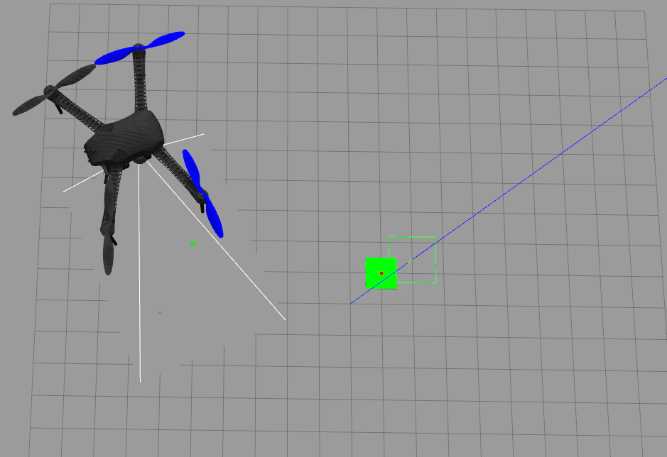

# Ardupilot Gazebo Plugin & Models



## Requirements :

Ubuntu Xenial (16.04 LTS) or Ubuntu Biotic (18.04)

ArduPilot with Build Environment Setup for Ubuntu:

    http://ardupilot.org/dev/docs/building-setup-linux.html#building-setup-linux

Gazebo version 9.0 (Installation Instructions Below)


# Getting Started :
## How to Install :

### Desktop ROS Kinetic Installation (Optional) :

BE SURE TO INSTALL AS ROS-KINETIC-DESKTOP, NOT FULL
Full version will automatically install Gazebo 7
Install ROS without Gazebo installation, and then install Gazebo standalone

Follow instructions here:
    http://wiki.ros.org/kinetic/Installation/Ubuntu) 

### Install Gazebo 9 Standalone :

Follow instructions here:
    http://gazebosim.org/tutorials?tut=install_ubuntu  

### Install Development Files :

    sudo apt-get install libgazebo9-dev

### Setup Project :


````
git clone https://github.com/BAmercury/ardupilot_gazebo
cd ardupilot_gazebo
mkdir build
cd build
cmake ..
make -j4
sudo make install
````

### Environmental Variable Setup :

Edit the bashrc file:
````
pico ~/.bashrc
````

Add the following at the end of .bashrc file:
````
source /usr/share/gazebo/setup.sh

export GAZEBO_MODEL_PATH=~/Documents/ardupilot_gazebo/gazebo_models

export GAZEBO_RESOURCE_PATH=~/Documents/ardupilot_gazebo/gazebo_worlds:${GAZEBO_RESOURCE_PATH}

export PATH=$PATH:$HOME/ardupilot/Tools/autotest
export PATH=/usr/lib/ccache:$PATH
````


## How to Launch :

Open two terminal windows


### Terminal 1: Launch Gazebo World 

#### With Visualization :

For static target:
````
gazebo --verbose iris_irlock_demo.world
````

For moving target:
````
gazebo --verbose iris_irlock_rail_sim.world
````

#### Without Visualization :

For static target:
````
gzserver --verbose iris_irlock_demo.world
````

For moving target:
````
gzserver --verbose iris_irlock_rail_sim.world
````


### Terminal 2: Launch Ardupilot SITL :

In your Ardupilot repo, navigate to:
````
Tools/autotest/
````
Then run the following:
````
python sim_vehicle.py -v ArduCopter -f gazebo-iris --console
````

Wait a few minutes and let the drone get a 3D fix before

#### Terminal 2: Optional Run with external GCS (Mission Planner) :

You can run the simulator and control from Mission Planner by amending the following argument to sim_vehicle.py:

````
--out=udpout:<IP Address of Machine Running GCS>:14550
````

See more at:
    https://ardupilot.github.io/MAVProxy/html/getting_started/starting.html


## Log Files :

Go to your Ardupilot repository

Binary Logs will be located in:
````
/Tools/autotest/logs/
````

## Iris Drone Parameter File :

Go to your Ardupilot repository

Params for the drone can be customed by editing the following file:
````
/Tools/autotest/default_params/gazebo-iris.parm
````

## Gazebo Tuning and Development :

Located in the gazebo_worlds directory there are two world files:

    - Static Target Simulation: iris_irlock_demo.world
    - Moving Target Simulation: iris_irlocK_rail_sim.world

To debug the rail simulator you can use the:

    - rail_sim.world

Which would launch the rail simulator and its plugin by itself

From these world files, you can access various parameters such as the following:

    - update rate
    - max step size
    - camera configurations for Drone
    - Wind

To access specfic parameters for a model itself (Drone or Rail Sim) you will have to navigate to the gazebo_models folder and edit the corresponding model sdf file:

For the drone there is a small tree of .sdf's to go through:

    - iris_with_standoffs_demo
        - iris_with_standoffs
        - gimball_small_2d

For the rail sim you can edit:

    - Moving Target: rail_system
    - Static Target: iris_irlocK_demo.world

For model-level editing you can access properties such as:

    - Collision hit boxes
    - Sensors:
        - Noise
        - Placement
        - Update Rate
    - Material Properties:
        - Friction
        - Inertia
        - Mass
        - Velocity/Accelerations


